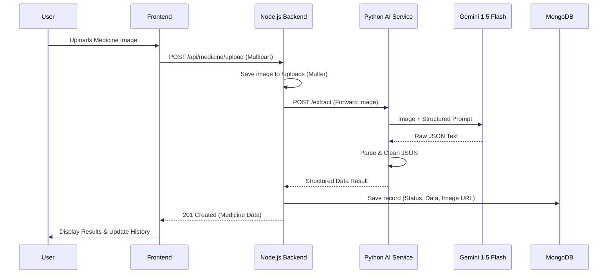

# Project Report: Medicine Image Extraction System

## 1. Project Overview
The **Medicine Image Extraction System** is an AI-powered full-stack application designed to automate the extraction of critical data from medicine packaging. By leveraging **Google Gemini 1.5 Flash**, the system identifies the medicine name, expiry date, batch number, and price from uploaded images, providing a structured digital record of physical medical products.

---

## 2. System Architecture & Working Model

### High-Level Architecture
The system follows a microservices-inspired architecture with three primary layers:
1.  **Frontend (UI)**: Built with React and Tailwind CSS.
2.  **Orchestration Backend**: A Node.js/Express server that manages file storage and database persistence.
3.  **AI Microservice**: A Python/FastAPI service dedicated to image processing and Gemini AI integration.

### Data Flow Model


---

## 3. Frontend Implementation details

The frontend is a modern, responsive web application built using **Vite** and **React**.

-   **Framework**: React 18
-   **Styling**: Tailwind CSS for a premium, clean aesthetic.
-   **State Management**: React Hooks (`useState`, `useEffect`, `useMemo`).
-   **Icons**: Lucide-react for consistent UI symbols.
-   **Feedback**: Sonner for rich, interactive toast notifications.

### Key Components
-   **`UploadCard.jsx`**: Handles file selection, drag-and-drop, and triggers the upload process.
-   **`ResultCard.jsx`**: Displays the AI-extracted information in a structured, readable card with status indicators (Success/Partial/Failed).
-   **`MedicineTable.jsx`**: An interactive history table showing all previous extractions with image previews.
-   **`StatsRow.jsx`**: Provides a quick summary of total records, today's uploads, and the AI success rate.

---

## 4. Node.js Backend & Orchestration

The Node.js backend serves as the central hub for the application.

-   **Runtime**: Node.js v18+
-   **Framework**: Express.js
-   **File Storage**: Local storage via **Multer** (saves to `uploads/`).
-   **Communication**: Axios for making HTTP calls to the Python microservice.

### Core Logic (`medicineController.js`)
The backend orchestrates the multi-step process:
1.  **File Reception**: Receives the image via a multipart request.
2.  **AI Integration**: Forwards the image to the Python service. If the AI service is down, it gracefully creates a "failed" record in the database for tracking.
3.  **Persistence**: Saves the AI's JSON output (including raw response and status) to MongoDB using Mongoose.

---

## 5. Python AI Microservice

A high-performance microservice built with **FastAPI** to handle the heavy lifting of AI extraction.

-   **Framework**: FastAPI (Asynchronous)
-   **AI SDK**: `google-generativeai`
-   **Prompt Engineering**: Uses a strictly defined prompt to force Gemini to return valid, unformatted JSON.

### Gemini Prompt Strategy
The service uses **Gemini 1.5 Flash** for its speed and vision capabilities. The prompt explicitly instructs the AI:
-   To return **ONLY** valid JSON.
-   To set missing fields to `null` instead of guessing.
-   To focus on specific fields: `medicine_name`, `expiry_date`, `batch_number`, and `price`.

---

## 6. Database Schema (MongoDB)

The data is stored in MongoDB using **Mongoose**. The schema is designed for auditing and history tracking.

### `Medicine` Model Fields
| Field | Type | Description |
| :--- | :--- | :--- |
| `medicine_name` | String | Extracted name + dosage |
| `expiry_date` | String | Expiry date (stored as string to preserve format) |
| `batch_number` | String | Batch/Lot number |
| `price` | Number | Extracted MRP (numeric) |
| `image_url` | String | Path to the stored file in the backend |
| `extraction_status` | Enum | `success`, `partial`, or `failed` |
| `raw_ai_response` | Mixed | The complete JSON response from Gemini for debugging |
| `createdAt` | Date | Auto-generated timestamp |

---

## 7. API Reference

### Medicine Endpoints (Node.js)
-   `POST /api/medicine/upload`: Uploads an image and triggers extraction.
-   `GET /api/medicine`: Fetches all saved records (newest first).
-   `GET /api/medicine/:id`: Fetches a single record by its MongoDB ID.

### Extraction Endpoint (Python)
-   `POST /extract`: Accepts an image file and returns AI-extracted medicine data.

---

## 8. Setup & Installation

### Prerequisites
-   Node.js & NPM
-   Python 3.10+
-   MongoDB Instance
-   Google Gemini API Key

### Running the Project
1.  **Python Service**:
    ```bash
    cd python-ai-service
    pip install -r requirements.txt
    python -m uvicorn app.main:app --port 8000
    ```
2.  **Node Backend**:
    ```bash
    cd node-backend
    npm install
    npm run dev
    ```
3.  **Frontend**:
    ```bash
    cd frontend
    npm install
    npm run dev
    ```

---

## 9. Conclusion
This system demonstrates a robust integration of modern web technologies with cutting-edge Generative AI. By decoupling the AI logic from the main backend, the system remains scalable, maintainable, and resilient to failures.
